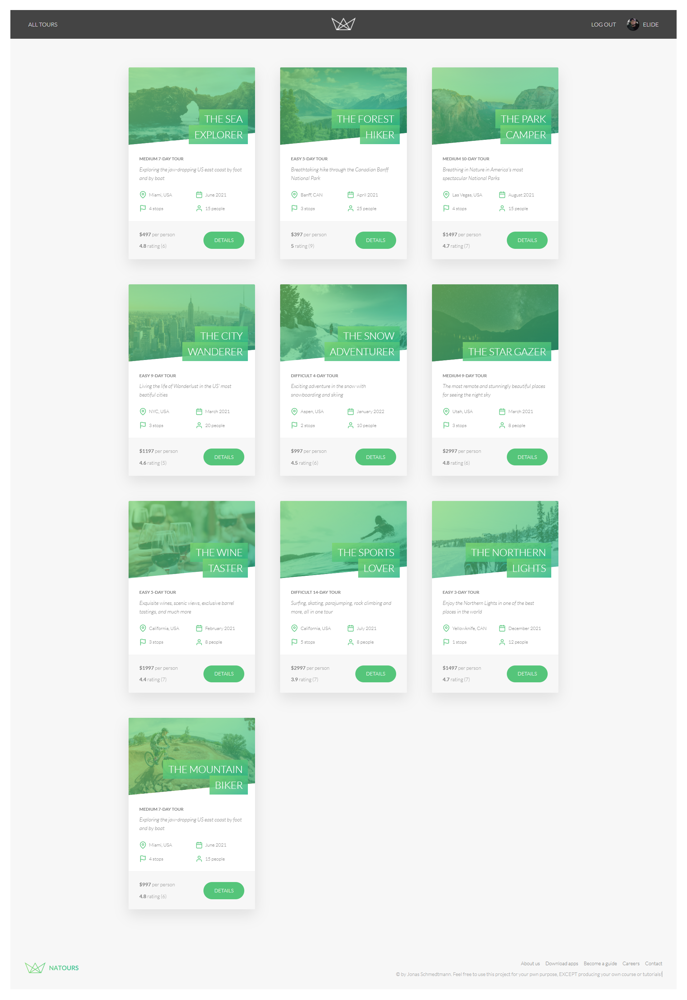
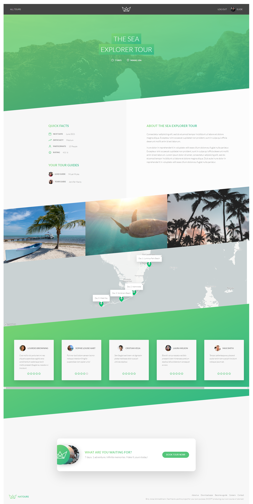
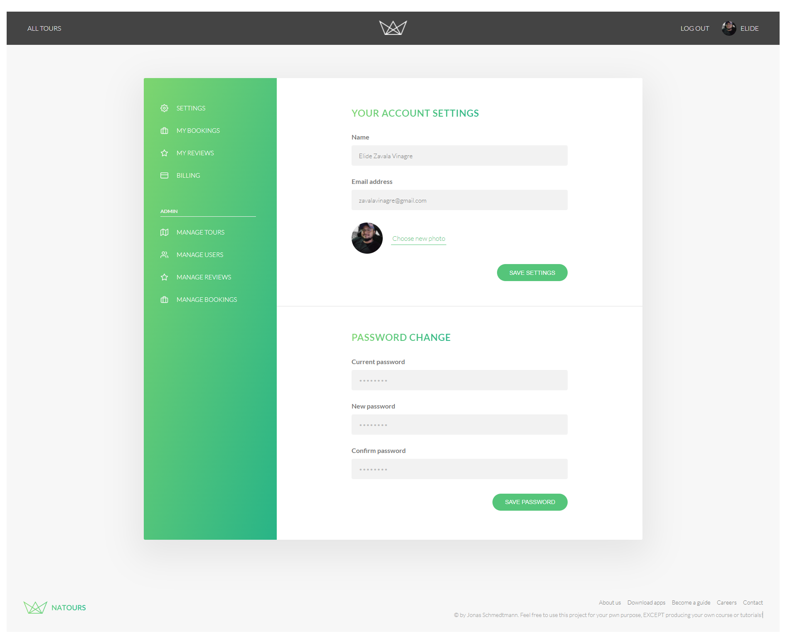
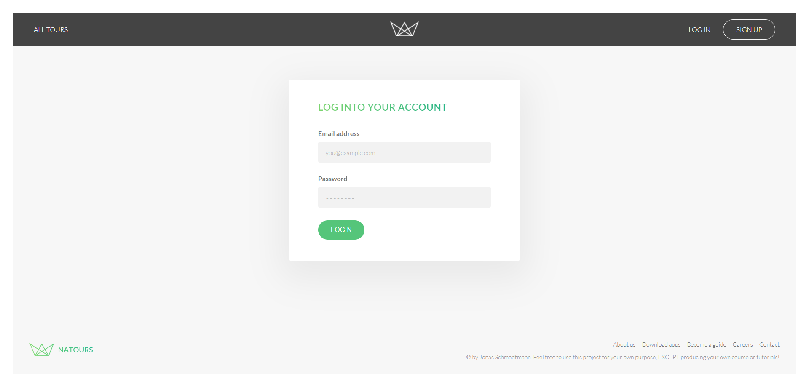

<h1 align="center">
  
   
  Natours Application
   
</h1>

<h3 align="center">Built using modern technologies: node.js, express. mongoDB, mongoose and friends.</h3>
<h4 align="center"><a href="https://nodejs.org/en/" target="_blank">NodeJS</a>.</h4>

<h2 align="center" fontWeightBold="900"> Website </h2>

### All Tours

### Tour

### Setting User 

### Login 
 

#### Documentación en Postman
**Link ➡** *https://documenter.getpostman.com/view/134223UVsJw6nC*

